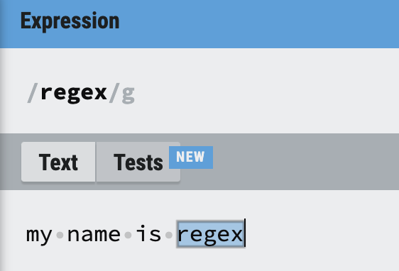
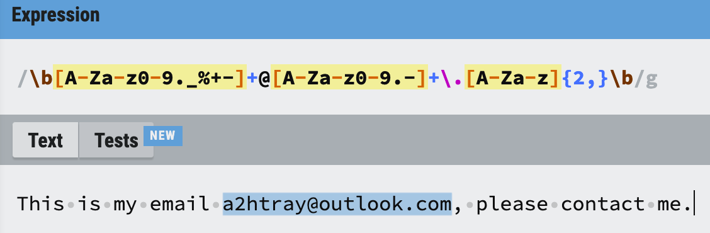
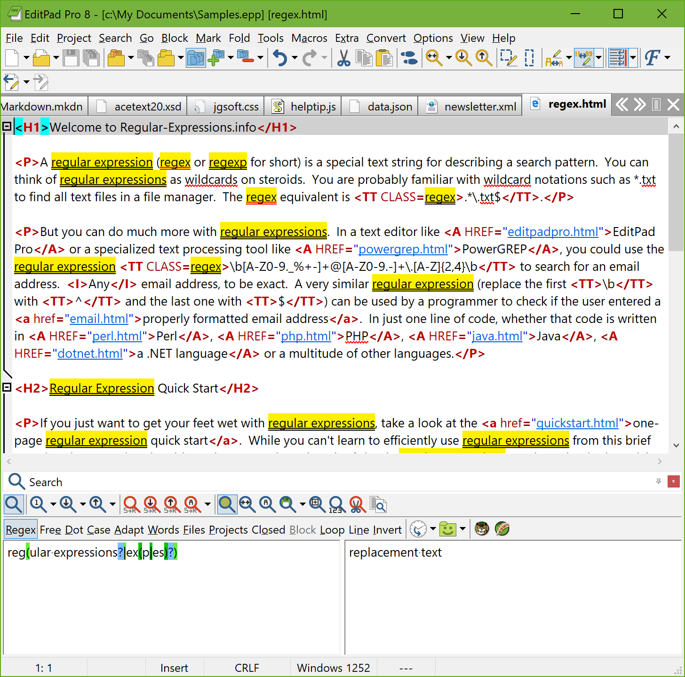

正则表达式教程 - 介绍。

<!--more-->

## 学习如何使用和充分利用正则表达式

这篇教程会教会你所有关于如何创造高效正则表达式的方法。教程从最基础的概念开始，所以即使你不懂正则表达式也没有关系，你也可能跟上教程的节奏。本教程会讲解正则表达式引擎的工作机制，理解正则表达式引擎有助于对一些疑难杂症的问题快速寻找解决方案。同时，本教程也旨在节约你学习正则表达式的时间，带你更好地入门。

## 什么是正则表达式

一般来说，正则表达式是指用于描述某特定长度文本的**模式字符串**，正则的名字来源于数学方法，但本教程并不会深入数学。正则一般可以缩写为 regex 和 regexp，本教程使用 regex（PS：翻译过程中使用 regex 表示正则）。在书写的过程中，使用 `regex` 表示一个正则表达式字符串。

第 1 个示例 `regex` 是一个完全合法的正则表达式，它是一个最简单的正则匹配模式，仅仅可以匹配字符串 <font color="blue">regex</font>。如：



术语 `匹配项（match）`是根据正则表达式从文本中找到的一个文本片段，在本教程中使用<font color="blue">蓝底字</font>表示匹配项。`\b[A-Za-z0-9._%+-]+@[A-Za-z0-9.-]+\.[A-Za-z]{2,}\b` 是一个复杂的正则表达式，它描述了一系列的字母 `A-Za-z`、数字 `0-9`、点号 `.`、下划号 `_`、百分号 `%`、加号 `+` 及减号 `-` 的文本，然后文本后接一个 `@` 符号，再接另一系列的字母、数字、点号、减号的文本，最后接至少两个的大写字母。换言之，该模式描述的是一个邮箱。如：



正则表达式各部分说明如：

```bash
\b[A-Za-z0-9._%+-]+@[A-Za-z0-9.-]+\.[A-Za-z]{2,}\b
- \b 边界符
- [A-Za-z0-9._%+-] 、 [A-Za-z0-9.-] 及 [A-Za-z] 为字符
- \. 转义
```

通过上述的邮箱正则表达式，你可以在一段文本中找到邮箱字符串，或者给定一个字符串并判断其是否为一个邮箱。在本教程中，使用术语`字符串`表示一串字符。在实际应用中，你可以在程序或编程语言中的任意数据上使用正则表达式。

## 不同的正则表达式引擎

正则表达式引擎可以是一个可处理正则表达式的程序或软件，引擎可以在给定的文本中通过模式串找到特定的字符串。通常情况下，正则表达式引擎只是一个大型应用的部分功能，并且你也不能直接修改该引擎。当需要正则表达式时，只要确保在合法的数据上使用，你可以随时的使用正则表达式引擎。

在不同的编程语言或软件中，各正则表达式引擎并不是完全兼容，正则的语法也有各自的特点。本教程会涵盖所有流行的正则表达式的特点，包括 [Perl](https://www.regular-expressions.info/perl.html)、[PCRE](https://www.regular-expressions.info/pcre.html)、[PHP](https://www.regular-expressions.info/php.html)、[.NET](https://www.regular-expressions.info/dotnet.html)、 [Java](https://www.regular-expressions.info/java.html)、[JavaScript](https://www.regular-expressions.info/javascript.html)、[XRegExp](https://www.regular-expressions.info/xregexp.html)、[VBScript](https://www.regular-expressions.info/vbscript.html)、[Python](https://www.regular-expressions.info/python.html)、[Ruby](https://www.regular-expressions.info/ruby.html)、[Delphi](https://www.regular-expressions.info/delphi.html)、[R](https://www.regular-expressions.info/rlanguage.html)、[Tcl](https://www.regular-expressions.info/tcl.html)、[POSIX](https://www.regular-expressions.info/posix.html) 或 [其它](https://www.regular-expressions.info/tools.html)，并介绍各正则引擎的不同之处。当然，如果教程的内容没有涵盖到你使用的语言或应用，也会介绍一些其它的正则库供你使用。

## 正则初探

你可以很轻松地在支持正则表达式的文本编辑器使用正则表达式，如 [EditPad Pro](https://www.regular-expressions.info/editpadpro.html)。如果你没有这样的编辑器，可以下免费版本的[免费版本](https://www.editpadpro.com/download.html)。



将本文的内容复制到 EditPad Pro 上，然后选择 Search|Multiline Search Panel in the menu，在编辑器的底部就正则所匹配到的字符串。作为开发者的你，也必须熟悉一门编程语言，你只要使用自己熟悉的语言就可以快速的尝试正则表达式。使用正则表达式可以减少你的开发时间，因为在众多语言中，声明一个正则并利用语言提供的方法，代码量要比自己去解析要来得少很多。