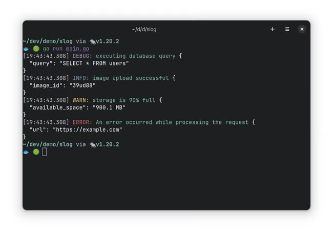

在学习 log/slog 标准包的过程中，我搜索到一篇全面讲解 log/slog 标准包的文章，感受良多，故将其翻译成中文并分享到微信公众号。

原文地址：[https://betterstack.com/community/guides/logging/logging-in-go/](https://betterstack.com/community/guides/logging/logging-in-go/)

<!--more-->

**正文开始**

结构化日志记录是指以明确定义的格式（通常为 JSON）来产生日志记录，为程序日志提供了一定程度的可组织性和一致性，使其更易于处理。此类日志记录由 key/value 对组成，key/value 对通常包含所记录日志的相关上下文信息，例如日志记录的严重性、时间戳、源代码位置、相关标识或任何其它相关元信息。

Go 1.21 引入的 log/slog 标准包旨在提供高性能的结构化、日志级别记录的功能，本文将会聚焦于 log/slog 标准包，深入研究 Go 语言中的结构化日志记录。

 在开始之前，我们会先验证下已有 log 包并指出它的局限，然后再详细介绍新的 log/slog 包中的所有重要内容。

## log 标准包

在讨论结构化日志包前，我们先验证下 log 标准包，该包提供以一种简单的方式将日志消息输出到终端、文件或者任意只要实现 io.Writer 接口的类型。下面是 Go 中最基本输出日志消息的方式：

```go
package main

import "log"

func main() {
    log.Println("Hello from Go application!")
}
```

输出：

```bash
2023/03/08 11:43:09 Hello from Go application!
```

终端输出中包含了日志消息以及消息产生的时间戳。Println() 方法是预先配置的全局 Logger 可用方法的其中一个，它将消息输出到标准错误。全局 Logger 可用的方法如下：

```go
log.Print()
log.Printf()
log.Fatal()
log.Fatalf()
log.Fatalln()
log.Panic()
log.Panicf()
log.Panicln()
```

Fatal 族和 Panic 族方法的不同之处在于：前者会在日志记录之后调用 os.Exit(1) 而后者则会调用 panic()。

通过 log.Default() 方法获得默认 Logger 之后，你可以对 Logger 进行定制化。下面的示例中，将默认 Logger 输出从标准错误配置成标准输出：

```go
func main() {
    defaultLogger := log.Default()
    defaultLogger.SetOutput(os.Stdout)
    log.Println("Hello from Go application!")
}
```

当然，你也可以通过 log.New() 方法构建完全定制化的 Logger，log.New() 的函数声明如下：

```go
func New(out io.Writer, prefix string, flag int) *Logger
```

第 1 个参数表示日志消息的目的地，只要该参数的类型实现了 io.Writer 接口即可。第 2 个参数和第 3 个参数分别为日志消息的前缀字符串和添加到日志消息中的常量集合（控制日志内容）。

```go
func main() {
    logger := log.New(os.Stdout, "", log.LstdFlags)
    logger.Println("Hello from Go application!")
}
```

上述示例中的 logger 的输出配置成了标准输出，并且不对日志消息添加前缀，因此它的输出与之前一样：

```go
2023/03/08 11:44:17 Hello from Go application!
```

现在，我们对 Logger 进行定制，为每一条日志记录添加程序名、文件名和日志行信息。同时，我们还为时间戳添加了微秒信息以及将本地时间替换成 UTC 时间：

```go
logger := log.New(
  os.Stderr,
  "MyApplication: ",
  log.Ldate|log.Ltime|log.Lmicroseconds|log.LUTC|log.Lshortfile,
)
```

定制化后的 Logger 输出：

```bash
MyApplication: 2023/03/08 10:47:12.348478 main.go:14: Hello from Go application!
```

定制后 Logger 输出的日志包含了"MyApplication: "前缀、微秒、文件名和日志行信息，这些信息可以帮助我们更快地定位到具体的源代码。

## log 标准包的局限

尽管 log 标准包提供了一种方便的方式来初始化日志记录，但由于一些局限，log 标准包并不适合用于生产环境。log 标准包的局限如下：

1. 缺少日志级别：日志级别是大多数日志包的主要功能之一，但 log 标准包缺少了这一功能。由于所有日志记录都一视同仁，所以无法基于重要程度或严重程度对这些日志记录进行过滤和区分。
2. 不支持结构化日志：log 标准包的输出是纯文本信息，不支持结构化（如 JSON）的方式记录日志记录。在监控、报警、诊断等各类分析中，结构化日志可以更好通过程序自动进行逐条解析和分析。
3. 不涉及上下文：log 标准包不支持上下文日志记录，导致无法自动记录日志相关的上下文信息（如请求 ID、用户 ID 或其它值）。
4. 不支持日志采样：对于高通量的程序来说，日志采样可以有效地减少日志所占的磁盘空间。第三方日志包通常会提供这一功能，但在 log 标准包中没有这一功能。
5. 有限的配置选项：log 标准包仅仅支持有限的配置选项，例如设置日志的输出，日志前缀。高级的日志包通常可以提供更多的可选配置，例如日志格式、上下文数据、异步日志、错误处理等。

鉴于上述的局限，新引入的 log/slog 标准包正好弥补了这一空白。简单地说，log/slog 标准包旨在为 Go 语言提供结构化日志的能力，以及创建通用日志接口来集成其它日志包。

## 结构化日志包 log/slog

log/slog 标准包起源于 Github 上的一次讨论（<https://github.com/golang/go/discussions/54763>），并由此产了关于新日志包的提议。log/slog 标准包一经确立，就在 Go 1.21 版本中发布了。

我们会从 log/slog 标准包的设计和架构来对其进行讨论。该包包含 3 个我们需要熟悉的主要类型：

- Logger：log/slog 标准包的前端类型，该类型提供了如Info() 和 Error()等用于记录日志的方法。
- Record：由 Logger 产生的独立的日志记录对象。
- Handler：log/slog 标准包的后端类型，一旦实现了这一接口，就确定了日志记录的格式及目的地。log/slog 标准包提供了两种默认的 Handler 实现：TextHandler 和 JSONHandler。

接下来的章节中，我们会通过相应的示例来详细介绍、验证上述 3 个类型。

### 开始

和绝大多数日志框架一样，log/slog 标准包会用最顶层的函数来暴露一个默认的 Logger。默认 Logger 的日志级别为 INFO，并且会以纯文本的方式将日志输出到标准输出。

```go
package main

import (
    "log/slog"
)

func main() {
    slog.Debug("Debug message")
    slog.Info("Info message")
    slog.Warn("Warning message")
    slog.Error("Error message")
}
```

```bash
2023/03/15 12:55:56 INFO Info message
2023/03/15 12:55:56 WARN Warning message
2023/03/15 12:55:56 ERROR Error message
```

你还可以使用 slog.New() 方法来创建自定义的 Logger 实例。slog.New() 方法接受一个非 nil 的 Handler 接口，该接口确定了日志的格式以及写入位置。下面是一个使用 JSONHandler 类型并且将日志输出到标准输出的示例：

```go
func main() {
    logger := slog.New(slog.NewJSONHandler(os.Stdout, nil))
    logger.Debug("Debug message")
    logger.Info("Info message")
    logger.Warn("Warning message")
    logger.Error("Error message")
}
```

输出：

```bash
{"time":"2023-03-15T12:59:22.227408691+01:00","level":"INFO","msg":"Info message"}
{"time":"2023-03-15T12:59:22.227468972+01:00","level":"WARN","msg":"Warning message"}
{"time":"2023-03-15T12:59:22.227472149+01:00","level":"ERROR","msg":"Error message"}
```

需要注意的是，默认的自定义 Logger 的日志级别也是 INFO，这样会抑制 DEBUG 级别日志的输出。如果你使用的是 TextHandler 类型，其输出的日志格式遵循 logfmt 标准（<https://brandur.org/logfmt>）。

```go
logger := slog.New(slog.NewTextHandler(os.Stdout, nil))
```

输出：

```go
time=2023-03-15T13:00:11.333+01:00 level=INFO msg="Info message"
time=2023-03-15T13:00:11.333+01:00 level=WARN msg="Warning message"
time=2023-03-15T13:00:11.333+01:00 level=ERROR msg="Error message"
```

## 定制化默认 Logger

如果要配置默认的 Logger，最直接的方式就是调用 slog.SetDefault() 方法，该方法可以将默认 Logger 替换成自定义的 Logger。

```go
func main() {
    logger := slog.New(slog.NewJSONHandler(os.Stdout, nil))

    slog.SetDefault(logger)

    slog.Info("Info message")
}
```

```json
{"time":"2023-03-15T13:07:39.105777557+01:00","level":"INFO","msg":"Info message"}
```

正如上述示例所现，你应该注意到在调用顶层日志 slog.Info() 方法后，Logger 的输出格式为 JSON。同样的，我们注意到 SetDefault() 也修改了 log 标准包使用的默认 log.Logger。这一改变使得使用 log.Printf() 的应用程序也能够用类似的方法来实现结构化日志功能。

```go
func main() {
    logger := slog.New(slog.NewJSONHandler(os.Stdout, nil))

    slog.SetDefault(logger)

    log.Println("Hello from old logger")
}
```

输出：

```json
{"time":"2023-03-16T15:20:33.783681176+01:00","level":"INFO","msg":"Hello from old logger"}
```

当你需要使用 API 用到的 Logger 时，slog.NewLogLogger() 方法也可以将一个 slog.Logger 转换成 log.Logger。

```go
func main() {
  handler := slog.NewJSONHandler(os.Stdout, nil)

  logger := slog.NewLogLogger(handler, slog.LevelError)

  server := http.Server{
    ErrorLog: logger,
  }
}
```

## 上下文日志记录

相较于传统的以纯文本形式记录日志，结构化日志有着更明显的优势，即允许以 key/value 对的形式在日志中表示任一属性。这些属性可以表示日志事件的上下文信息，而这些信息对于一些诸如故障检查、实时指标、审计之类的任务非常有用。下面是一个示例：

```go
logger.Info(
  "incoming request",
  "method", "GET",
  "time_taken_ms", 158,
  "path", "/hello/world?q=search",
  "status", 200,
  "user_agent", "Googlebot/2.1 (+http://www.google.com/bot.html)",
)
```

输出：

```json
{
  "time":"2023-02-24T11:52:49.554074496+01:00",
  "level":"INFO",
  "msg":"incoming request",
  "method":"GET",
  "time_taken_ms":158,
  "path":"/hello/world?q=search",
  "status":200,
  "user_agent":"Googlebot/2.1 (+http://www.google.com/bot.html)"
}
```

所有级别的方法，如 Info()、Debug() 等，都接受一个日志消息作为其第一个参数，接着后面是不限数量的松散类型的 key/value 对。API 类似于 Zap 日志包的 SugaredLogger API，是以额外的内存分配为代价优先考虑了 API 的简洁性。然而，如果你不注意，这也会导致一些奇怪的问题，最明显的就是 key 和 value 数量对不上就会产生有问题的输出：

```go
logger.Info(
  "incoming request",
  "method", "GET",
  "time_taken_ms", // 缺少了相应的值
)
```

因为作为 key 的 time_taken_ms 缺失了相应的值，它会被认为一个 key 为 !BADKEY 的值：

```json
{
  "time": "2023-03-15T13:15:29.956566795+01:00",
  "level": "INFO",
  "msg": "incoming request",
  "method": "GET",
  "!BADKEY": "time_taken_ms"
}
```

因为参数数量对不上导致错误的日志产生，这一问题可能只有到你用到日志信息时才会察觉。虽然该提议建议使用 vet 工具来检查缺失的 key/value 对问题，但在代码审查时也需要额外小心，我们要确保 key/value 对是匹配且类型正确的。

如果希望防止 key/value 对不匹配问题的发生，可以使用强类型的属性，如下：

```go
logger.Info(
  "incoming request",
  slog.String("method", "GET"),
  slog.Int("time_taken_ms", 158),
  slog.String("path", "/hello/world?q=search"),
  slog.Int("status", 200),
  slog.String(
    "user_agent",
    "Googlebot/2.1 (+http://www.google.com/bot.html)",
  ),
)
```

尽管这是一种更好的上下文日志记录的方法，但它也并不是万无一失的。因为在实际场景中，无法确保你不会混合使用强类型和松散类型的组合，如下：

```go
logger.Info(
  "incoming request",
  "method", "GET",
  slog.Int("time_taken_ms", 158),
  slog.String("path", "/hello/world?q=search"),
  "status", 200,
  slog.String(
    "user_agent",
    "Googlebot/2.1 (+http://www.google.com/bot.html)",
  ),
)
```

为了确保记录上下文日志记录的类型安全，你必须使用下面的 logAttrs() 方法：

```go
logger.LogAttrs(
  context.Background(),
  slog.LevelInfo,
  "incoming request",
  slog.String("method", "GET"),
  slog.Int("time_taken_ms", 158),
  slog.String("path", "/hello/world?q=search"),
  slog.Int("status", 200),
  slog.String(
    "user_agent",
    "Googlebot/2.1 (+http://www.google.com/bot.html)",
  ),
)
```

该方法只接受 slog.Attr 类型的自定义属性，所以可以保证 key/value 对不匹配问题不会发生。这个 API 相对比较复杂些，因为你总是需要为日志传入上下文和日志级别。

### 上下文属性分组

log/slog 标准包还提供对属性分组的功能，分组后的日志展示则是根据使用不同的 Handler 而不同。比如在 JSONHandler 中，组的形式是一个单独的 JSON 对象：

```go
logger.LogAttrs(
  context.Background(),
  slog.LevelInfo,
  "image uploaded",
  slog.Int("id", 23123),
  slog.Group("properties",
    slog.Int("width", 4000),
    slog.Int("height", 3000),
    slog.String("format", "jpeg"),
  ),
)
```

```json
{
  "time":"2023-02-24T12:03:12.175582603+01:00",
  "level":"INFO",
  "msg":"image uploaded",
  "id":23123,
  "properties":{
    "width":4000,
    "height":3000,
    "format":"jpeg"
  }
}
```

当使用 TextHandler 时，分组名则为每个字段的前缀，如：

```bash
time=2023-02-24T12:06:20.249+01:00 level=INFO msg="image uploaded" id=23123 properties.width=4000 properties.height=3000 properties.format=jpeg
```

## 创建和使用子 Logger

在特定的程序作用域下，所有日志记录中包含相同的属性有助于减少代码量，而不需要重复使用记录语句。这就是子 Logger 的用武之处，因为子 Logger 是继承于父 Logger 且包含额外上下文字段的 Logger。

在 log/slog 标准包中，使用 Logger.With() 方法创建子 Logger，该方法接受一系列强类型和松散类型的 key/value 对，并且返回包含特定属性的 Logger。在一个给定的程序作用域下，使用子 Logger 有助于在所有日志记录中包含相同的属性，这样就不用在每个日志记录点重复显示输出。这就是子 Logger 的作用，它会继承父 Logger 且带有额外的属性。试想下下方面的代码，每一个日志记录中需要包含程序的进程 ID 和 Go 版本号，并且将它们保存在 program_info 字段。

```go
func main() {
    handler := slog.NewJSONHandler(os.Stdout, nil)
    buildInfo, _ := debug.ReadBuildInfo()

    logger := slog.New(handler)

    child := logger.With(
        slog.Group("program_info",
            slog.Int("pid", os.Getpid()),
            slog.String("go_version", buildInfo.GoVersion),
        ),
    )

    . . .
}
```

在子 Logger 的配置处，所有子 Logger 的日志记录都会带有 program_info 字段。

```go
func main() {
    . . .

    child.Info("image upload successful", slog.String("image_id", "39ud88"))
    child.Warn(
        "storage is 90% full",
        slog.String("available_space", "900.1 mb"),
    )
}
```

```json
{
  "time": "2023-02-26T19:26:46.046793623+01:00",
  "level": "INFO",
  "msg": "image upload successful",
  "program_info": {
    "pid": 229108,
    "go_version": "go1.20"
  },
  "image_id": "39ud88"
}
{
  "time": "2023-02-26T19:26:46.046847902+01:00",
  "level": "WARN",
  "msg": "storage is 90% full",
  "program_info": {
    "pid": 229108,
    "go_version": "go1.20"
  },
  "available_space": "900.1 MB"
}
```

你也可以使用 WithGroup() 方法来创建一个带有初始组（Group）的子 Logger，这样所有记录属性都会被添加到这个组中：

```go
handler := slog.NewJSONHandler(os.Stdout, nil)
buildInfo, _ := debug.ReadBuildInfo()
logger := slog.New(handler).WithGroup("program_info")

child := logger.With(
  slog.Int("pid", os.Getpid()),
  slog.String("go_version", buildInfo.GoVersion),
)

child.Info("image upload successful", slog.String("image_id", "39ud88"))
child.Warn(
  "storage is 90% full",
  slog.String("available_space", "900.1 MB"),
)
```

```json
{
  "time": "2023-05-24T19:00:18.384085509+01:00",
  "level": "INFO",
  "msg": "image upload successful",
  "program_info": {
    "pid": 1971993,
    "go_version": "go1.20.2",
    "image_id": "39ud88"
  }
}
{
  "time": "2023-05-24T19:00:18.384136084+01:00",
  "level": "WARN",
  "msg": "storage is 90% full",
  "program_info": {
    "pid": 1971993,
    "go_version": "go1.20.2",
    "available_space": "900.1 mb"
  }
}
```

## 自定义日志级别

log/slog 标准包提供 4 种默认日志级别，分别为 DEBUG(-4)、INFO(0)、WARN(4) 和 ERROR(8)。各数值的区间是为了更好的配置自定义的日志级别以实现更优的日志设计。例如，你可以创建一个在 INFO 和 WARN 之间的自定义日志级别 NOTICE，其值可以是 1、2 或 3。

你可能已经注意到，所有的 Logger 默认的日志级别为 INFO，这也导致了数值低于 INFO 的日志级别（如 DEBUG）的记录不会被输出。你可以通过 HandlerOptions 自定义日志级别：

```go
func main() {
    opts := &slog.HandlerOptions{
        Level: slog.LevelDebug,
    }

    handler := slog.NewJSONHandler(os.Stdout, opts)

    logger := slog.New(handler)
    logger.Debug("Debug message")
    logger.Info("Info message")
    logger.Warn("Warning message")
    logger.Error("Error message")
}
```

```bash
{"time":"2023-05-24T19:03:10.70311982+01:00","level":"DEBUG","msg":"Debug message"}
{"time":"2023-05-24T19:03:10.703187713+01:00","level":"INFO","msg":"Info message"}
{"time":"2023-05-24T19:03:10.703190419+01:00","level":"WARN","msg":"Warning message"}
{"time":"2023-05-24T19:03:10.703192892+01:00","level":"ERROR","msg":"Error message"}
```

上述方式创建了一个日志级别为 DEBUG 的 Logger，如果你希望创建一个支持动态日志级别的 Logger，可以使用如下方式：

```go
logLevel := &slog.LevelVar{} // INFO

opts := slog.HandlerOptions{
  Level: logLevel,
}

// you can change the level anytime like this
logLevel.Set(slog.LevelDebug)
```

### 创建自定义日志级别

如何你不想使用 log/slog 标准包提供的默认日志级别，你可以构建一个实现 Leveler 接口的结构：

```go
type Leveler interface {
    Level() Level
}
```

还有一种简便的方式，就是使用已经实现了 Leveler 接口的 slog.Level 结构，如下：

```go
const (
    LevelTrace  = slog.Level(-8)
    LevelNotice = slog.Level(2)
    LevelFatal  = slog.Level(12)
)
```

一旦你定义了上面的日志级别，你就可以像下面的方式使用：

```go
opts := &slog.HandlerOptions{
    Level: LevelTrace,
}

logger := slog.New(slog.NewJSONHandler(os.Stdout, opts))

ctx := context.Background()
logger.Log(ctx, LevelTrace, "Trace message")
logger.Log(ctx, LevelNotice, "Notice message")
logger.Log(ctx, LevelFatal, "Fatal level")
```

```bash
{"time":"2023-02-24T09:26:41.666493901+01:00","level":"DEBUG-4","msg":"Trace level"}
{"time":"2023-02-24T09:26:41.66659754+01:00","level":"INFO+2","msg":"Notice level"}
{"time":"2023-02-24T09:26:41.666602404+01:00","level":"ERROR+4","msg":"Fatal level"}
```

上面代码是如何创建自定义日志级别的方法，但这可能并不是你想要的，所以你应该通过 HandlerOptions 结构的方式定制化你的日志级别：

```go
. . .

var LevelNames = map[slog.Leveler]string{
    LevelTrace:      "TRACE",
    LevelNotice:     "NOTICE",
    LevelFatal:      "FATAL",
}

func main() {
    opts := slog.HandlerOptions{
        Level: LevelTrace,
        ReplaceAttr: func(groups []string, a slog.Attr) slog.Attr {
            if a.Key == slog.LevelKey {
                level := a.Value.Any().(slog.Level)
                levelLabel, exists := LevelNames[level]
                if !exists {
                    levelLabel = level.String()
                }

                a.Value = slog.StringValue(levelLabel)
            }

            return a
        },
    }

    . . .
}
```

```bash
{"time":"2023-02-24T09:27:51.747625912+01:00","level":"TRACE","msg":"Trace level"}
{"time":"2023-02-24T09:27:51.747732118+01:00","level":"NOTICE","msg":"Notice level"}
{"time":"2023-02-24T09:27:51.747737319+01:00","level":"FATAL","msg":"Fatal level"}
```

ReplaceAttr() 方法可用于定制化日志记录中 key/value 对的输出展示，它可以实现根据一个特定的 key并转换其 value 的输出结果。在上述的示例中，我们使用 map 结构保存了各自日志级别的字符串表示：TRACE、NOTICE 和 FATAL。

## 自定义 Handler

在上述众多使用 TextHandler 和 JSONHandler 的示例中，你已经学会了如何调整最小日志级别和如何个性日志记录的属性。如果需要的话，还有一种定制化的方式，就是通过 HandlerOptions 来在日志记录中记录日志源代码信息：

```go
opts := slog.HandlerOptions{
  AddSource: true,
  Level: slog.LevelDebug,
}
```

```bash
{"time":"2023-05-24T19:39:27.005871442+01:00","level":"DEBUG","source":{"function":"main.main","file":"/home/ayo/dev/demo/slog/main.go","line":30},"msg":"Debug message"}
{"time":"2023-05-24T19:39:27.005940778+01:00","level":"INFO","source":{"function":"main.main","file":"/home/ayo/dev/demo/slog/main.go","line":31},"msg":"Info message"}
{"time":"2023-05-24T19:39:27.00594459+01:00","level":"WARN","source":{"function":"main.main","file":"/home/ayo/dev/demo/slog/main.go","line":32},"msg":"Warning message"}
{"time":"2023-05-24T19:39:27.005947669+01:00","level":"ERROR","source":{"function":"main.main","file":"/home/ayo/dev/demo/slog/main.go","line":33},"msg":"Error message"}
```

根据程序运行环境切换相应的 Handler 也非常方便。例如，你可能希望在开发环境中使用 TextHandler，但在生产环境使用 JSONHandler，这个需求你可以通过环境变量来实现：

```go
var appEnv = os.Getenv("APP_ENV")

func main() {
    opts := &slog.HandlerOptions{
        Level: slog.LevelDebug,
    }

    var handler slog.Handler = slog.NewTextHandler(os.Stdout, opts)
    if appEnv == "production" {
        handler = slog.NewJSONHandler(os.Stdout, opts)
    }

    logger := slog.New(handler)

    logger.Info("Info message")
}
```

```bash
go run main.go
```

```bash
time=2023-02-24T10:36:39.697+01:00 level=INFO msg="Info message"
```

```bash
APP_ENV=production go run main.go
```

```json
{"time":"2023-02-24T10:35:16.964821548+01:00","level":"INFO","msg":"Info message"}
```

### 创建自定义 Handler

因为 Handler 是一个接口，所以你同样可以创建自定义的 Handler 来格式化日志记录，或者修改日志记录的目的地，其声明如下： 

```go
type Handler interface {
    Enabled(context.Context, Level) bool
    Handle(context.Context, r Record) error
    WithAttrs(attrs []Attr) Handler
    WithGroup(name string) Handler
}
```

下面的示例中，使用了 log、json 和 color 包来实现对日志记录的着色操作： 

```go
// NOTE: 仅做示例
package main

import (
    "context"
    "encoding/json"
    "io"
    "log"
    "log/slog"

    "github.com/fatih/color"
)

type PrettyHandlerOptions struct {
    SlogOpts slog.HandlerOptions
}

type PrettyHandler struct {
    slog.Handler
    l *log.Logger
}

func (h *PrettyHandler) Handle(ctx context.Context, r slog.Record) error {
    level := r.Level.String() + ":"

    switch r.Level {
    case slog.LevelDebug:
        level = color.MagentaString(level)
    case slog.LevelInfo:
        level = color.BlueString(level)
    case slog.LevelWarn:
        level = color.YellowString(level)
    case slog.LevelError:
        level = color.RedString(level)
    }

    fields := make(map[string]interface{}, r.NumAttrs())
    r.Attrs(func(a slog.Attr) bool {
        fields[a.Key] = a.Value.Any()

        return true
    })

    b, err := json.MarshalIndent(fields, "", "  ")
    if err != nil {
        return err
    }

    timeStr := r.Time.Format("[15:05:05.000]")
    msg := color.CyanString(r.Message)

    h.l.Println(timeStr, level, msg, color.WhiteString(string(b)))

    return nil
}

func NewPrettyHandler(
    out io.Writer,
    opts PrettyHandlerOptions,
) *PrettyHandler {
    h := &PrettyHandler{
        Handler: slog.NewJSONHandler(out, &opts.SlogOpts),
        l:       log.New(out, "", 0),
    }

    return h
}
```

你可以像下方的方式使用 PrettyHandler：

```go
func main() {
    opts := PrettyHandlerOptions{
        SlogOpts: slog.HandlerOptions{
            Level: slog.LevelDebug,
        },
    }
    handler := NewPrettyHandler(os.Stdout, opts)
    logger := slog.New(handler)
    logger.Debug(
        "executing database query",
        slog.String("query", "SELECT * FROM users"),
    )
    logger.Info("image upload successful", slog.String("image_id", "39ud88"))
    logger.Warn(
        "storage is 90% full",
        slog.String("available_space", "900.1 MB"),
    )
    logger.Error(
        "An error occurred while processing the request",
        slog.String("url", "https://example.com"),
    )
}
```

执行程序之后，你可以看到着色后的输出：



## 通过 LogValuer 隐藏敏感字段

LogValuer 接口允许你定义一个自定义类型如何被记录，其声明如下：

```go
type LogValuer interface {
    LogValue() Value
}
```

最简单的用法是实现一个可以隐藏敏感字段的 LogValuer，在没有实现 LoggerValuer 的情况下，User 类型会将所有可导出的字段进行输出：

```go
// User does not implement `LogValuer` here
type User struct {
    ID        string `json:"id"`
    FirstName string `json:"first_name"`
    LastName  string `json:"last_name"`
    Email     string `json:"email"`
    Password  string `json:"password"`
}

func main() {
    handler := slog.NewJSONHandler(os.Stdout, nil)
    logger := slog.New(handler)

    u := &User{
        ID:        "user-12234",
        FirstName: "Jan",
        LastName:  "Doe",
        Email:     "jan@example.com",
        Password:  "pass-12334",
    }

    logger.Info("info", "user", u)
}
```

输出：

```go
{
  "time": "2023-02-26T22:11:30.080656774+01:00",
  "level": "INFO",
  "msg": "info",
  "user": {
    "id": "user-12234",
    "first_name": "Jan",
    "last_name": "Doe",
    "email": "jan@example.com",
    "password": "pass-12334"
  }
}
```

在没有实现 LoggerValuer 之前，整个 User 的信息都会被输出。这是一个比较严重的问题，因为某些类型中可能包含一些敏感的字段（如邮箱和密码），这类信息不需要出现在日志中：

```go
// implement the `LogValuer` interface
func (u *User) LogValue() slog.Value {
    return slog.StringValue(u.ID)
}
```

实现 LogValue 方法后，你的输出发生了改变：

```json
{
  "time": "2023-02-26T22:43:28.184363059+01:00",
  "level": "INFO",
  "msg": "info",
  "user": "user-12234"
}
```

同样的，你也可以对属性进行分组输出： 

```go
func (u *User) LogValue() slog.Value {
    return slog.GroupValue(
        slog.String("id", u.ID),
        slog.String("name", u.FirstName+" "+u.LastName),
    )
}
```

输出：

```json
{
  "time": "2023-03-15T14:44:24.223381036+01:00",
  "level": "INFO",
  "msg": "info",
  "user": {
    "id": "user-12234",
    "name": "Jan Doe"
  }
}
```

## 最后的想法

我们希望这篇文章可以帮助你更好地理解 Go 中新的结构化日志包并将其使用在你的项目之中，如果你希望了解更多与之相关的内容，我建议你去翻阅[提议](https://go.googlesource.com/proposal/+/master/design/56345-structured-logging.md)和[包文档](https://pkg.go.dev/log/slog)。

感谢您的阅读并开始快乐的日志之旅吧！


