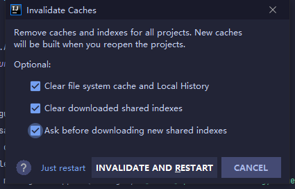

IntelliJ IDEA 代码显示灰色，表示无任何引用，实际上是有引用。出现这种问题，非常不易于 DEBUG。

<!--more--> 

解决方法：File -> Invalidate Caches ...

勾选：

1. Clear file system cache and Local History
2. Ask before downloading new shared indexes

