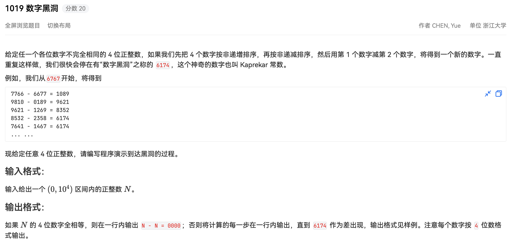

## 代码

```python
#!/usr/bin/env python
# -*- coding: utf-8 -*-
# author: a2htray
# create date: 2023/3/6

"""
PAT 乙级 1019
"""


def get_sorted_nums(num_str):
    dn = 4 - len(num_str)
    for _ in range(dn):
        num_str = '0' + num_str

    nums = list(map(int, num_str))
    nums.sort()

    return 1 * nums[0] + 10 * nums[1] + 100 * nums[2] + 1000 * nums[3], \
           1 * nums[3] + 10 * nums[2] + 100 * nums[1] + 1000 * nums[0]


num_str = input()
num1, num2 = get_sorted_nums(num_str)

if num1 == num2:
    print(f'{num1:04d} - {num2:04d} = 0000')
    exit(0)

while num1 - num2 != 6174:
    diff = num1 - num2
    print(f'{num1:04d} - {num2:04d} = {diff:04d}')
    num1, num2 = get_sorted_nums(str(diff))

diff = num1 - num2
print(f'{num1:04d} - {num2:04d} = {diff:04d}')
```

