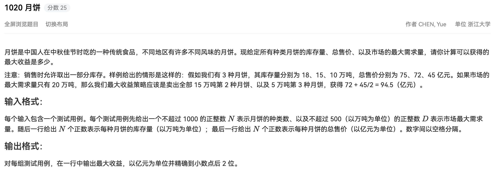

## 代码

```python
#!/usr/bin/env python
# -*- coding: utf-8 -*-
# author: a2htray
# create date: 2023/3/6

"""
PAT 乙级 1020
"""
from functools import cmp_to_key


class MoonCake:
    def __init__(self, num, total_price):
        self.num = num
        self.total_price = total_price
        self.unit_price = 1.0 * self.total_price / self.num


def cmp(mooncake1, mooncake2):
    return -1 if mooncake1.unit_price > mooncake2.unit_price else 1


if __name__ == '__main__':
    n_class, max_requirement = map(int, input().split(' '))

    mooncakes = []
    for item in zip(map(float, input().split(' ')), map(float, input().split(' '))):
        if item[0] == 0 or item[1] == 0:
            continue
        mooncakes.append(MoonCake(item[0], item[1]))

    mooncakes = sorted(mooncakes, key=cmp_to_key(cmp))

    sale_price = 0.0

    for i in range(n_class):
        if max_requirement >= mooncakes[i].num:
            sale_price += mooncakes[i].total_price
            max_requirement = max_requirement - mooncakes[i].num
        else:
            sale_price += max_requirement * mooncakes[i].unit_price
            max_requirement = 0
            break

    print('%.2f' % sale_price)
```

