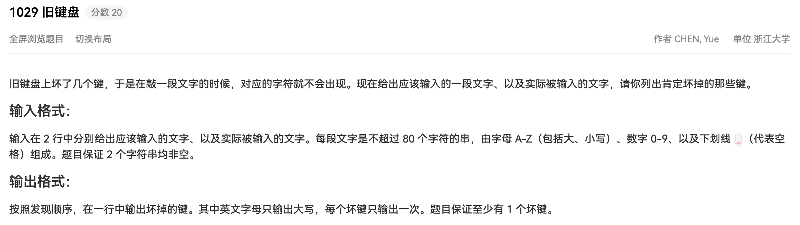

## 代码

```bash
#!/usr/bin/env python
# -*- coding: utf-8 -*-
# author: a2htray
# create date: 2023/3/12

"""
PAT 乙级 1029
"""

if __name__ == '__main__':
    statement1 = input()
    statement2 = input()

    got_dict = {}

    statement1 = statement1.upper()
    statement2 = statement2.upper()
    for c in statement1:
        if c not in got_dict:
            if c not in statement2:
                got_dict[c] = True
                print(c, end='')
```

