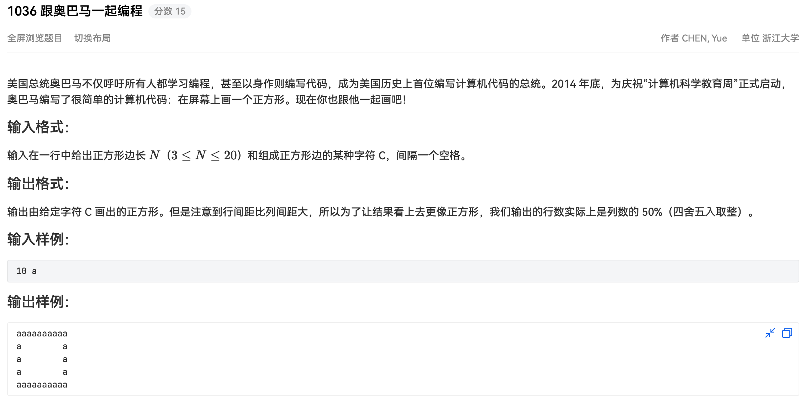

## 代码

```python
#!/usr/bin/env python
# -*- coding: utf-8 -*-
# author: a2htray
# create date: 2023/3/13

"""
PAT 乙级 1036
"""

if __name__ == '__main__':
    tokens = input().split(' ')

    n = int(tokens[0])
    c = tokens[1]

    row_num = str(1.0 * n / 2)
    if '.' in row_num:
        num, fraction = row_num.split('.')
        if 5 <= int(fraction[0]) <= 9:
            num = int(num) + 1
        else:
            num = int(num)
    else:
        num = int(row_num)

    num = int(num)

    for i in range(num):
        if i == 0 or i == num - 1:
            print(''.join([c] * n))
            continue
        print(''.join([c] + [' '] * (n - 2) + [c]))
```

