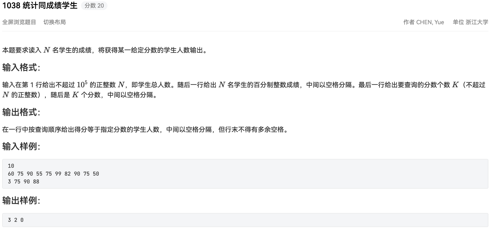

## 代码

```python
#!/usr/bin/env python
# -*- coding: utf-8 -*-
# author: a2htray
# create date: 2023/3/13

"""
PAT 乙级 1038
"""

if __name__ == '__main__':
    n = int(input())
    scores = {}

    for score in input().split(' '):
        if score not in scores:
            scores[score] = 0
        scores[score] += 1

    counts = []
    for score in input().split(' ')[1:]:
        if score in scores:
            counts.append(scores[score])
        else:
            counts.append('0')
    print(' '.join(map(str, counts)))
```

