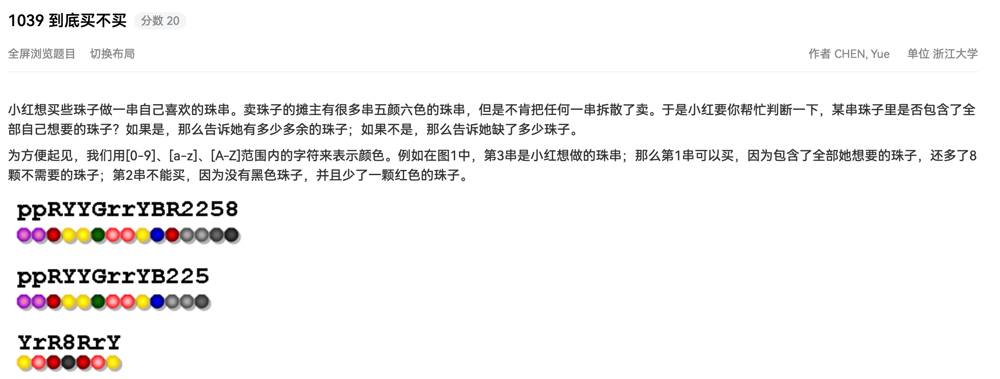

## 代码

```python
#!/usr/bin/env python
# -*- coding: utf-8 -*-
# author: a2htray
# create date: 2023/3/25

"""
PAT 乙级 1039
"""


def color_stat(s):
    stat = {}
    for c in s:
        if c not in stat:
            stat[c] = 0
        stat[c] = stat[c] + 1
    return stat


if __name__ == '__main__':
    line1 = input()
    line2 = input()

    stat1 = color_stat(line1)
    stat2 = color_stat(line2)
    absent = 0
    for color, num in stat2.items():
        if color in stat1:
            if stat1[color] >= num:
                stat1[color] -= num
            else:
                absent += num - stat1[color]
        else:
            absent += num

    if absent == 0:
        print('Yes', sum(stat1.values()))
    else:
        print('No', absent)
```

