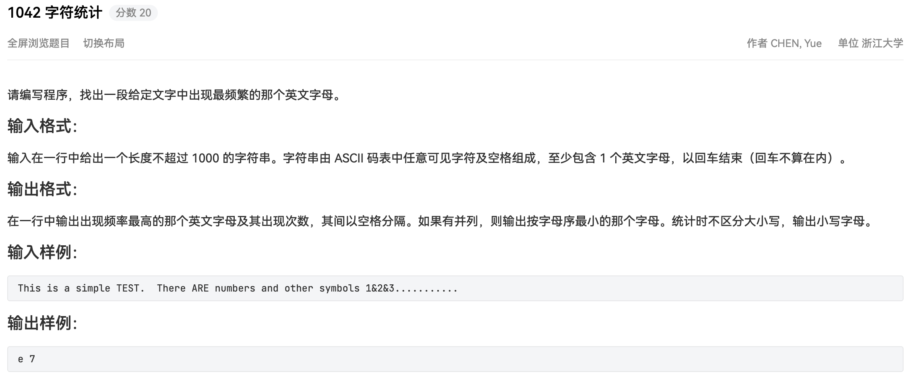

## 代码

```python
#!/usr/bin/env python
# -*- coding: utf-8 -*-
# author: a2htray
# create date: 2023/3/25

"""
PAT 乙级 1042
"""

if __name__ == '__main__':
    line = input()
    stat = [0] * 26

    for c in line:
        if ord('a') <= ord(c) <= ord('z'):
            stat[ord(c) - ord('a')] += 1
        if ord('A') <= ord(c) <= ord('Z'):
            stat[ord(c) - ord('A')] += 1

    max_num = max(stat)

    print(chr(ord('a') + stat.index(max_num)), max_num)
```

