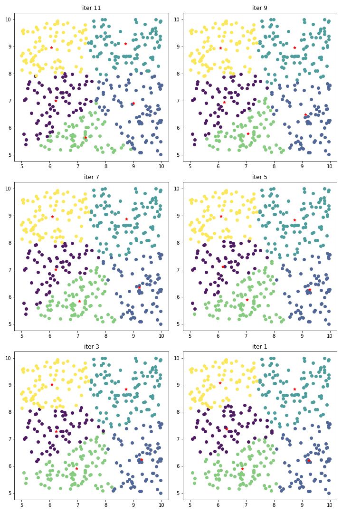

k-means 算法是一种无监督的聚类算法，其优点是逻辑简单、易于实现。

<!--more-->

## 基本原理

质心是指一个簇中样本的均值向量，k-means 中的 `means` 就是从这里来的。当确定 k 个质心后，需要计算样本与 k 个质心的距离，而样本则归属于距离最近的质心所在的簇。随着算法的迭代，质心的位置会发生变化。质心的变化程度也是算法结束的一个条件，迭代前后质心位置变化通常使用 `SSE` 来刻画。

<!--
SSE = \sum^k_{i=1} \sqrt {\sum^n_{j=1} {\lvert c^{(t+1)}_{ij} - c^{(t)}_{ij}\rvert}^2} -->


其中 $n$ 是质心的维数，$c^{(t)}_{ij}$ 表示 $t$ 次迭代中第 $i$ 个质心的第 $j$ 维值。 


### 步骤

1. 确定 k 值、最大迭代数及误差值；
2. 随机选择 k 个样本作为质心；
3. 分别计算样本与质心的距离，将样本划分到 k 个簇；
4. 重新计算 k 个簇的质心，比较前后质心的误差；
   1. 若误差小于等于设置的误差值，则算法结束；
   2. 若误差大于设置的误差值，则执行步骤 5；
5. 判断是否达到最大迭代数，若未达到则执行步骤 3，否则算法结束；

### 问题

选择 k-means 算法做聚类分析时，以下几个问题值得注意：

1. 初始质心的选择；
2. k 值的确定；
3. 距离公式的确定；

k-means 算法容易局部最优，并且算法的结果在很大程度上取决于初始质心的选择，不同的初始质心可能会得到截然不同的聚类结果。同时，在面对未知类别个数的数据集时，如何确定 k 值也是一件麻烦事。通常做法都在小样本集上尝试不同的 k 值，然后比较聚类的结果并将 k 值定为跑得最好结果的那次 k 值。距离公式的选择则是需要依靠领域知识，因为在不同的领域中，样本的相似度的计算方式会有所不同。

## 完整代码

```python
import numpy as np
import matplotlib.pyplot as plt

def distance(x1, x2):
    """欧式距离"""
    return np.sqrt(np.sum(np.power(x1 - x2, 2)))


def sse(centroids1, centroids2):
    return np.sum(np.sqrt(np.sum(np.power(centroids1 - centroids2, 2), axis=1)))


def update_centroid(centroids, data):
    r, _ = data.shape
    cluster_idxs = []
    for i in range(len(centroids)):
        cluster_idxs.append([])

    for i in range(r):
        ds = np.array([distance(data[i], centroid) for centroid in centroids])
        sorted_idxs = np.argsort(ds)
        cluster_idxs[sorted_idxs[0]].append(i)

    new_centroids = []
    for i, cluster_idx in enumerate(cluster_idxs):
        if len(cluster_idx) == 0:
            new_centroids.append(centroids[i])
        else:
            new_centroids.append(np.mean(data[cluster_idx], axis=0))

    return np.array(new_centroids)


def initial_centroids(k, data):
    r, _ = data.shape
    idxs = np.arange(0, r)
    np.random.shuffle(idxs)
    return data[idxs[:k]]


def cluster(centroids, data):
    r, _ = data.shape
    cluster_idxs = []
    for i in range(len(centroids)):
        cluster_idxs.append([])

    for i in range(r):
        ds = np.array([distance(data[i], centroid) for centroid in centroids])
        sorted_idxs = np.argsort(ds)
        cluster_idxs[sorted_idxs[0]].append(i)
    return cluster_idxs


data = np.random.uniform(5, 10, size=(400, 2))

k = 5
colors = ['#4e9e9d', '#86cc7f', '#506798', '#4f1b63', '#fbe85a']
tol = 1e-6
iteration = 12
plt.figure(figsize=(10, 4))

fig = plt.figure(figsize=(10, 15))
axes = fig.subplots(nrows=3, ncols=2)

centroids = initial_centroids(k, data)
i = 0
while iteration >= 0:
    if iteration % 2 == 1:
        cluster_idxs = cluster(centroids, data)
        for color_idx, cluster_idx in enumerate(cluster_idxs):
            fig.axes[i].scatter(data[cluster_idx][:,0], data[cluster_idx][:,1], c=colors[color_idx])
        fig.axes[i].scatter(centroids[:,0], centroids[:,1], s=30, marker='*', c='red')
        fig.axes[i].set_title('iter %d' % iteration)
        i = i + 1

    new_centroids = update_centroid(centroids, data)
    if sse(new_centroids, centroids) <= tol:
        centroids = new_centroids
        break
    centroids = new_centroids
    iteration = iteration - 1
```

下图是执行得到的一次结果图：



## 其它

1. [帖子](https://www.researchgate.net/post/Is-c-means-same-as-k-means-in-clustering-algorithm-context)讨论了 k-means 和 c-means 是否是相同的概念，得票最多的回答认为是同一概念，所以本文对两者不作区分；

## 总结

1. k-means 算法结束的两个条件；
   1. 迭代结束；
   2. 质心位置变化小于误差值；
2. Python 实现 k-means 算法；

