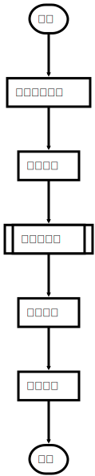
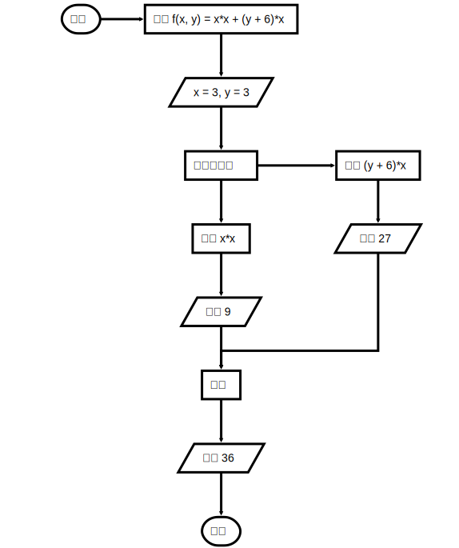

 &emsp;&emsp;流程图是一种可用于表示工作流操作、算法步骤和程序控制等的图形化展示，常常被运用于软件开发过程中，也是开发者之间交流的一种媒介。流程图的使用场景很多，其作用也不言而喻。比如在Data Mining Process<sup>[1]</sup> 一文中，作者使用流程图来阐释数据挖掘工作的一般过程，简单易懂。绘制流程图的工具有很多，如 ProcessOn、亿图展示、Dia、Processist 和 Draw.io 等<sup>[2]</sup>。

## flowchart.js 简介

&emsp;&emsp;flowchart.js 是一种可以运行在<font color="red">终端和浏览器</font>的流程图领域特定语言，专门用于绘制流程图且可输出 SVG 图片<sup>[3]</sup>。flowchart.js 的节点和连接信息可以分开定义，这样即保证了节点的可复用性，也提高了连接信息修改的效率。flowchart.js 基于文本绘制流程图，但相对其它流程图工具来说，功能较少，所以只能绘制简单的流程图，正如其官网<sup>[4]</sup>所介绍的那样：Draw simple SVG flow chart diagrams from textual representation of the diagram。

## 节点与连接

&emsp;&emsp;节点与连接是流程图中最重要的两种元素，本节分别对这两种元素进行说明。

### 节点

&emsp;&emsp;流程图是由多个节点相互连接的图像，flowchart.js 定义了多种节点类型，如下表：

| 节点名称  | 关键字         | 形状         | 说明                  |
| ----- | ----------- | ---------- | ------------------- |
| 开始    | start       | 圆角矩形       | 定义流程图的开始            |
| 处理操作  | operation   | 矩形         | 流程图中某一操作或步骤         |
| 条件判断  | condition   | 菱形         | 根据判断结果有条件执行下一步操作    |
| 输入/输出 | inputoutput | 平行四边形      | 可作为操作的输入或输出         |
| 子流程   | subroutine  | 上下边重合的嵌套矩形 | 表示流程中内部流程，防止流程图内容过多 |
| 并行操作  | parallel    | 矩形         | 后续操作可并行             |
| 结束    | end         | 圆角矩形       | 定义流程图的开始            |

&emsp;&emsp;在 flowchart.js 中，声明一个节点的格式如下：

```bash
节点名称=>关键字: 显示文本[:>链接]
```

`:>链接`为可选内容，用于表示节点点击后要跳转的链接。

### 连接

&emsp;&emsp;节点与节点之间需要通过连接符进行连接，用于表示数据流或工作流的方向，使用 `->` 表示。节点的连接信息不需要在一行中定义，即下方两种连接信息是等价的：

```bash
# 定义 1
node1->node2->node3

# 定义 2
node1->node2
node2->node3
```

节点与节点连接时，可以约束前置节点的行为，比如方向，格式如下：

```bash
node1(spec1, spec2)->node2
```

方向的定义包括 `left`、`rigght`、`top` 和 `bottom`。同时，不同类型的节点可约束的行为不尽相同，比如除 end 类型的节点，其余节点都可以约束方向。

## 示例

&emsp;&emsp;上文中有提到，flowchart.js 支持在终端和浏览器中成像，分别对应着两种不同的使用方法：

1. 终端：diagrams 命令行工具输出 SVG 图像；
2. 浏览器：引用 flowchart.js 文件，通过 JS 脚本生成并显示流程图；

### diagrams

&emsp;&emsp;diagrams 是用于生成多种类型图像的命令工具，可生成的图像包括：流程图、时序图等<sup>[5]</sup>。diagrams 安装命令及生成 flowchart.js 流程图如下：

```bash
npm install -g diagrams
diagrams flowchart xxx.flowchart xxx.svg
```

其中，`xxx.flowchart` 为语法定义文件，`xxx.svg` 为输出的 SVG 文件。

### 浏览器

&emsp;&emsp;flowchart.js 依赖于 [Raphaël](http://www.raphaeljs.com/)<sup>[6]</sup>，在 HTML 中需要引入两个 JS 文件：

```bash
<script src="raphael-min.js"><
<script src="flowchart-latest.js"></script>
```

HTML 代码大致如下：

```html
<div id="diagram"></div>
    <script>
        let diagram = flowchart.parse(`flowchart 流程图文本信息`)
        diagram.drawSVG('diagram')
    </script>
```

### 流程图示例

**数据挖掘流程图**

```bash
st=>start: 开始
state_the_problem=>operation: 确定领域问题
collect_the_data=>operation: 收集数据
data_preprocessing=>subroutine: 数据预处理
estimate_model=>operation: 模型评估
draw_conclusion=>operation: 得到结果
e=>end: 结束

st->state_the_problem->collect_the_data->data_preprocessing->estimate_model->draw_conclusion->e
```



**计算方程式**

```bash
st=>start: 开始
op_problem=>operation: 计算 f(x, y) = x*x + (y + 6)*x
x_y_input=>inputoutput: x = 3, y = 3
two_parts_compute=>parallel: 分两步计算
left_part=>operation: 计算 x*x
left_result=>inputoutput: 得到 9
right_part=>operation: 计算 (y + 6)*x
right_result=>inputoutput: 得到 27
op_add=>operation: 相加
add_result=>inputoutput: 得到 36
end=>end: 结束

st(right)->op_problem->x_y_input
x_y_input->two_parts_compute
two_parts_compute(path1, right)->right_part
two_parts_compute(path2, bottom)->left_part
right_part->right_result->op_add
left_part->left_result->op_add
op_add->add_result->end
```



## 参考

1. Data Mining Process [https://www.geeksforgeeks.org/data-mining-process/](https://www.geeksforgeeks.org/data-mining-process/)
2. 评测了10款画流程图软件，这4款最好用！（完全免费） [https://zhuanlan.zhihu.com/p/91344875](https://zhuanlan.zhihu.com/p/91344875)
3. adrai/flowchart.js [https://github.com/adrai/flowchart.js](https://github.com/adrai/flowchart.js)
4. flowchart.js [https://flowchart.js.org/](https://flowchart.js.org/)
5. selfless/diagrams [https://github.com/seflless/diagrams](https://github.com/seflless/diagrams)
6. Raphaël [http://www.raphaeljs.com/](http://www.raphaeljs.com/)