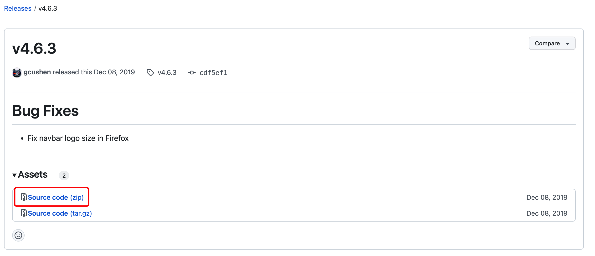

Four days ago, I got a requirement to build an academic website for [yunzila~](https://github.com/jingyunluo). This 
reminds me of my previous blog experience. Since my blog is built with Hugo, I started to find an academic theme which is 
designed for Hugo. Here is a link to [Hugo themes](https://themes.gohugo.io/), and then I find the [Academic](https://themes.gohugo.io/themes/starter-hugo-academic/)
theme developed by [gcushen](https://github.com/gcushen) which meets my needs.

<!--more-->

After reading the documents, I try to use the latest version of Wowchemy Academic theme but bad things always come. Yes, 
I get into trouble when I configure the Wowchemy 5.7. the Wowchemy 5+ is too difficult for newbies. So I make a decision 
to use Wowchemy 4.6.3. This post records my process of configuring an academic website with Hugo and Wowchemy 4.6.3.

# Install Hugo Extended

Why use Hugo extended? Because the theme has used `Sass` or `SCSS` to stylize. You can get a specific version of the source 
code from the GitHub by following command:

```bash
$ git clone -b v0.104.1 git@github.com:gohugoio/hugo.git
$ cd hugo
$ CGO_ENABLED=1 go install --tags extended
```

It is noted that the latest hugo is developed with Go 1.18, make sure that the Go 1.18+ is installed in your system. During
the execution of `CGO_ENABLED=1 go install --tags extended`, you may encounter some problems such as `package is missing`.
Here are some details of issues I experienced.

```bash
go: github.com/alecthomas/chroma/v2@v2.3.0 requires
github.com/alecthomas/repr@v0.1.0: missing go.sum entry; to add it:
go mod download github.com/alecthomas/repr
 
 ./../go/pkg/mod/github.com/cpuguy83/go-md2man/v2@v2.0.2/md2man/md2man.go:4:2: missing go.sum entry needed to verify package github.com/russross/blackfriday/v2 (imported by github.com/cpuguy83/go-md2man/v2/md2man) is provided by exactly one module; to add:
go get github.com/cpuguy83/go-md2man/v2/md2man@v2.0.2
```

For above issues, we need to run commands as follows:

```bash
$ go mod download github.com/alecthomas/repr@v0.1.0
$ go get github.com/cpuguy83/go-md2man/v2/md2man@v2.0.2
```

Now, we need to run `CGO_ENABLED=1 go install --tags extended` again to build a binary executable file which will be stored
to `$GOPATH/bin/`.

To test whether the hugo is installed:

```bash
$ hugo version
hugo v0.104.1-8958b8741f552c8024af5194330fbf031544a826+extended darwin/amd64 BuildDate=2022-09-26T17:05:45Z
```

# Install Wowchemy Academic Theme

At present, the theme is kept in this [repository]( https://github.com/wowchemy/wowchemy-hugo-themes). For the 4.6.3 version,
I suggest you to download the source code from the release page [v4.6.3](https://github.com/wowchemy/wowchemy-hugo-themes/releases/tag/v4.6.3).



If your website directory name is `academic-site`, you can execute the following commands to install the theme.

```bash
$ cd academic-site
$ mkdir themes/academic

# decompress the zip into the folder `themes/academic`
$cp -rf themes/academic/exampleSite/* ./
```

At last, you should to modify the theme code in `themes/academic/layouts/publication/single.html` at line 14.

```gotemplate
{{ if (.Params.publication_types) and (ne (index .Params.publication_types 0) "0") }}
```

changed to

```gotemplate
{{ if and (.Params.publication_types) (ne (index .Params.publication_types 0) "0") }}
```

You can run `hugo server` to get a glance the website.


# Write at Last

I will try to learn the structure of the theme code, and get the ability to do some modifications to make the theme more
customizable.