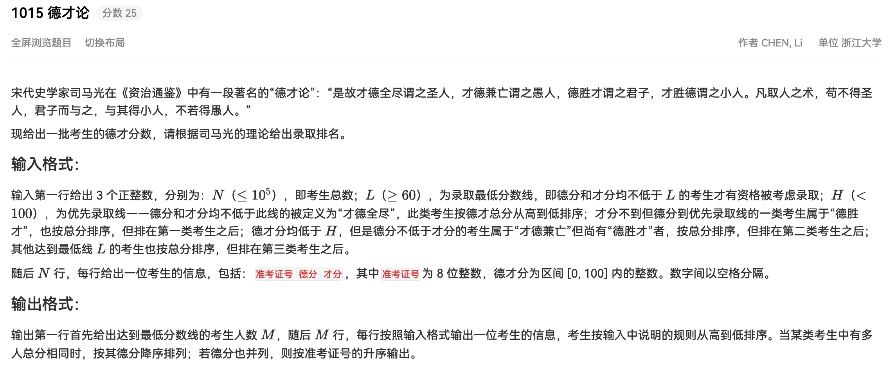

## 代码

```python
#!/usr/bin/env python
# -*- coding: utf-8 -*-
# author: a2htray
# create date: 2023/3/4

"""
PAT 乙级 1015
"""
from functools import cmp_to_key


def sort_students(student1, student2):
    total1 = sum(student1[1:])
    total2 = sum(student2[1:])
    if total1 != total2:
        return -1 if total1 > total2 else 1
    elif student1[1] != student2[1]:
        return -1 if student1[1] > student2[1] else 1
    else:
        return -1 if int(student1[0]) > int(student2[1]) else 1


if __name__ == '__main__':
    [n, base_score, priority_score] = list(map(int, input().split()))

    students = []
    while n != 0:
        tokens = input().split()
        students.append((tokens[0], int(tokens[1]), int(tokens[2])))
        n -= 1

    student_group = [[], [], [], []]

    for i, student in enumerate(students):
        # 德分和才分均低于最低分数线
        if student[1] < base_score or student[2] < base_score:
            continue

        # 德分和才分均大于等于优化分数线
        if student[1] >= priority_score and student[2] >= priority_score:
            student_group[0].append(student)
        elif student[1] >= priority_score > student[2]:
            student_group[1].append(student)
        elif student[1] < priority_score and student[2] < priority_score:
            if student[1] >= student[2]:
                student_group[2].append(student)
            else:
                student_group[3].append(student)
        else:
            student_group[3].append(student)

    m = sum([len(g) for g in student_group])
    print(m)

    student_group[0].sort(key=cmp_to_key(sort_students))
    student_group[1].sort(key=cmp_to_key(sort_students))
    student_group[2].sort(key=cmp_to_key(sort_students))
    student_group[3].sort(key=cmp_to_key(sort_students))

    students = student_group[0] + student_group[1] + student_group[2] + student_group[3]
    for student in students:
        print('%s %d %d' % (student[0], student[1], student[2]))
```

