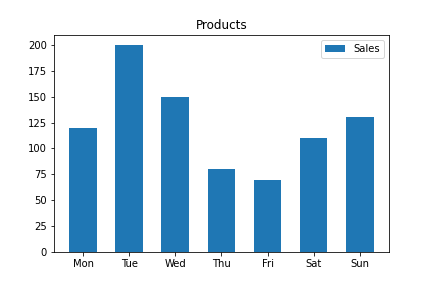
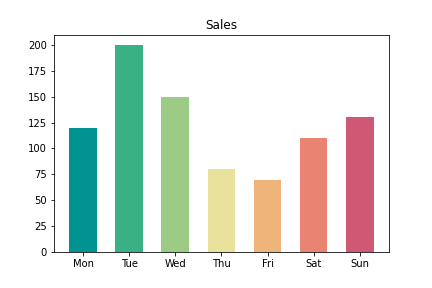
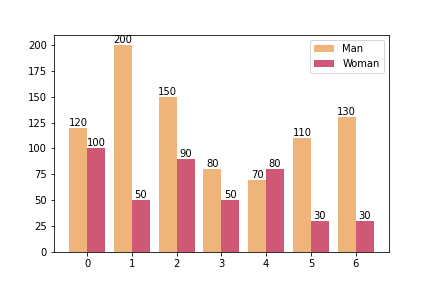
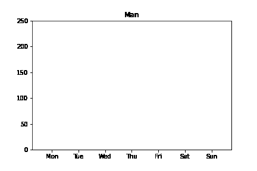

每当有快速绘制图表的需求时，第一时间反应到的肯定是 Matplotlib，因为其官方提供了详细的 API 文档及示例。但是每次在编码时，总是时不时地需要查看文档，不利用于可视化快速成型。所以在本文中罗列一些 bar 图的快速实现，方便 Ctrl+C/V。

<!--more-->

## 基本实现

```python
import matplotlib.pyplot as plt
import numpy as np

data = [120, 200, 150, 80, 70, 110, 130]
x = np.arange(len(data))

plt.bar(
    x, # bar 在 x 轴的位置
    data,
    width=0.6, # bar 的宽度
    label='Sales',
)
plt.xticks(
    x, # 标签的位置
    ['Mon', 'Tue', 'Wed', 'Thu', 'Fri', 'Sat', 'Sun'],
)
plt.legend()
plt.title('Products')
```



##  bar 设置颜色

```python
import matplotlib.pyplot as plt
import numpy as np

colors = ['#009392', '#39b185', '#9ccb86', '#e9e29c', '#eeb479', '#e88471', '#cf5974']
data = [120, 200, 150, 80, 70, 110, 130]
x = np.arange(len(data))

plt.bar(
    x,
    data,
    width=0.6,
    color=colors, # 单值或者可迭代对象，如果长度与数组不匹配则会从头反复使用色值
)
plt.xticks(
    x,
    ['Mon', 'Tue', 'Wed', 'Thu', 'Fri', 'Sat', 'Sun'],
)
plt.title('Sales')
```



## 显示数值

```python
import matplotlib.pyplot as plt
import numpy as np

colors = ['#009392', '#39b185', '#9ccb86', '#e9e29c', '#eeb479', '#e88471', '#cf5974']
data = [120, 200, 150, 80, 70, 110, 130]
x = np.arange(len(data))

bar = plt.bar(
    x,
    data,
    width=0.6,
    color=colors,
)
plt.bar_label(
    bar,
    label_type='edge', # 标签显示的位置，edge 为默认值；如果是 center 则显示在 bar 中间（垂直水平居中）
)
plt.xticks(
    x,
    ['Mon', 'Tue', 'Wed', 'Thu', 'Fri', 'Sat', 'Sun'],
)
plt.title('Sales')
```


## 层叠 bar 图

```python
import matplotlib.pyplot as plt
import numpy as np

data_man = [120, 200, 150, 80, 70, 110, 130]
data_woman = [100, 50, 90, 50, 80, 30, 30]
x = np.arange(len(data))
bar1 = plt.bar(
    x,
    data_man,
    label='Man',
    color='#009392',
)
bar2 = plt.bar(
    x,
    data_woman,
    bottom=data_man,
    label='Woman',
    color='#cf5974',
)
plt.bar_label(
    bar1,
    label_type='center',
    labels=data_man, # 设置显示的值
)
plt.bar_label(
    bar2,
    label_type='center',
    labels=data_woman,
)
plt.xticks(
    x,
    ['Mon', 'Tue', 'Wed', 'Thu', 'Fri', 'Sat', 'Sun'],
)
plt.legend()
```


## 多条 bar

通过调整 bar 的`位置`和`宽度`来实现多条 bar 不重叠显示。

```python
import matplotlib.pyplot as plt
import numpy as np

data_man = [120, 200, 150, 80, 70, 110, 130]
data_woman = [100, 50, 90, 50, 80, 30, 30]
x = np.arange(len(data))
width = 0.4
bar1 = plt.bar(
    x - width/2, # 位置
    data_man,
    width=width, # 宽度
    label='Man',
    color='#eeb479',
)
bar2 = plt.bar(
    x + width/2,
    data_woman,
    width=width,
    label='Woman',
    color='#cf5974',
)
plt.bar_label(bar1)
plt.bar_label(bar2)
plt.legend()
```



## 动态 bar 图

```python
import matplotlib.pyplot as plt
import numpy as np
from matplotlib.animation import FuncAnimation

data_man = [120, 200, 150, 80, 70, 110, 130]
frames = 10
fig = plt.figure()
axes = fig.add_subplot(1,1,1)
axes.set_ylim(0, 250)

def generate_animate_data(data, n):
    """生成每帧的数据"""
    animate_data = []
    for v in data:
        animate_data.append(np.linspace(0, v, n))
    return np.array(animate_data)

animate_data = generate_animate_data(data_man, frames)
def animate(i):
    plt.bar(
        ['Mon', 'Tue', 'Wed', 'Thu', 'Fri', 'Sat', 'Sun'],
        animate_data[:,i],
        color='#eeb479',
        label='Man'
    )

ani = FuncAnimation(
    fig,
    animate,
    frames=frames, # 帧数
    interval=300,
)

plt.title('Man')
```



## bar 图案

`plt.bar` 函数有两个可选参数 `facecolor` 和 `edgecolor` 控制。

```python
import matplotlib.pyplot as plt
import numpy as np

bar_styles = {
    'man': {
        'facecolor': '#ee8479',
        'edgecolor': 'black',
        'hatch': '//',
    },
    'woman': {
        'facecolor': '#cf5974',
        'edgecolor': 'black',
        'hatch': '--',
    }
}

data_man = [120, 200, 150, 80, 70, 110, 130]
data_woman = [100, 50, 90, 50, 80, 30, 30]
x = np.arange(len(data))
width = 0.4
bar1 = plt.bar(
    x - width/2,
    data_man,
    width=width,
    label='Man',
    **bar_styles['man']
)
bar2 = plt.bar(
    x + width/2,
    data_woman,
    width=width,
    label='Woman',
    **bar_styles['woman']
)
plt.bar_label(bar1)
plt.bar_label(bar2)
plt.legend()
```

