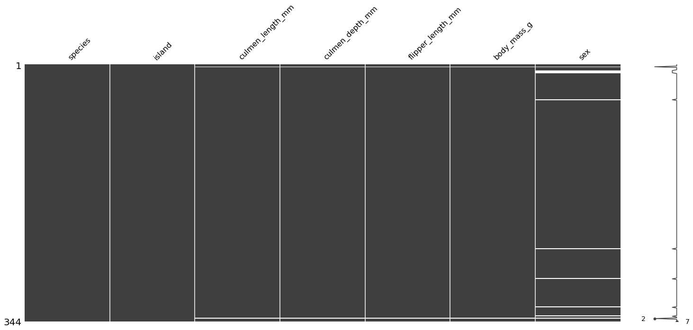

今天导师在群里分享了一个链接 [23 个优秀的机器学习训练公共数据集](https://www.infoq.cn/article/lx2t3k4fp2qmtudt0huo)，看了一下，决定对帕尔默企鹅数据集（Palmer Archipelago (Antarctica) penguin data）做一些分析。

<!-- more -->

## 数据集介绍

数据集是在 [Kaggle](https://www.kaggle.com/datasets/parulpandey/palmer-archipelago-antarctica-penguin-data?resource=download) 下载的，包含两个文件：

1. penguins_lter.csv：原始数据文件；
2. penguins_size.csv：特征约简后的数据文件；

本次分析使用的是简化后的数据集 `penguins_size.csv`。数据集共 344 个样本，特征信息如下表：

| 特征              | 数据类型 | 说明                                          |
| ----------------- | -------- | --------------------------------------------- |
| species           | 离散值   | 标签信息，值为 Adelie\|Chinstrap\|Gentoo 之一 |
| island            | 离散值   | 岛屿，值为 Torgersen\|Biscoe\|Dream 之一      |
| culmen_length_mm  | 连续值   | 喙的长度（mm）                                |
| culmen_depth_mm   | 连续值   | 喙的高度（mm）                                |
| flipper_length_mm | 连续值   | 脚蹼长度（mm）                                |
| body_mass_g       | 连续值   | 体重（克）                                    |
| sex               | 离散值   | 性别，值为 MALE\| FEMALE 之一                 |

> 数据集包含缺失数据，用 NA 表示特征值缺失，其中第 337 样本的 sex 特征值为“.”，在此也认为是缺失值。

使用 `pandas` 查看数据集的统计信息：

```go
import pandas as pd

df = pd.read_csv('./dataset/penguins_size.csv', na_values=['NA', '.'])
print(df.describe())
```

```bash
	culmen_length_mm  culmen_depth_mm  flipper_length_mm  body_mass_g
count        342.000000       342.000000         342.000000   342.000000
mean          43.921930        17.151170         200.915205  4201.754386
std            5.459584         1.974793          14.061714   801.954536
min           32.100000        13.100000         172.000000  2700.000000
25%           39.225000        15.600000         190.000000  3550.000000
50%           44.450000        17.300000         197.000000  4050.000000
75%           48.500000        18.700000         213.000000  4750.000000
max           59.600000        21.500000         231.000000  6300.000000
```

显然，统计信息中并不包含离散特征。

### 缺失数据

对数据集的缺失数据进行一次统计。

```python
# 打印出不完整样本在数据集中的下标
print(df.isna().any(axis=1).where(lambda not_exist: not_exist).dropna().index)
```

```bash
Int64Index([3, 8, 9, 10, 11, 47, 246, 286, 324, 336, 339], dtype='int64')
```

```python
# 打印出缺失特征值个数统计
print(df.isna().astype(int, False).sum())
```

```bash
species               0
island                0
culmen_length_mm      2
culmen_depth_mm       2
flipper_length_mm     2
body_mass_g           2
sex                  11
dtype: int64
```

使用 `missingno` 包来查看缺失数据分布：

```python
import missingno as msno

msno.matrix(df)
```



综上，得到以下结论：

1. 存在两个样本的 culmen_length_mm、culmen_depth_mm、flipper_length_mm、body_mass_g 和  sex 特征值缺失，编号分别为 3 和  339（以 0 为开始计数）；
2. 缺失值主要集中在 sex 特征中，共有 11 个样本存在缺失；

## 预测企鹅性别

预测企鹅性别中，sex 为目标特征，所以先计算连续型特征与目标特征的 [Point-biserial 相关系数](https://en.wikipedia.org/wiki/Point-biserial_correlation_coefficient) $r_{pb} (r_{pb} \in [0, 1])$。

```python
from scipy import stats

# 剔除数据集中不完整样本
df_com = df.drop([3, 8, 9, 10, 11, 47, 246, 286, 324, 336, 339], inplace=False)
# 计算 Point-biserial 相关系数
series_sex = df_com.loc[:,'sex'].copy()
series_sex[series_sex == 'MALE'] = 0
series_sex[series_sex == 'FEMALE'] = 1

print('Point-biserial')
for column in df_com.columns[2:6]:
    cor, pvalue = stats.pointbiserialr(series_sex, df_com[column])
    print(column, "<=>", 'sex')
    print("correlation: ", cor)
    print("pvalue: ", pvalue)
    print()
```

```bash
Point-biserial
culmen_length_mm <=> sex
correlation:  -0.34407778223748564
pvalue:  1.0942555387200282e-10

culmen_depth_mm <=> sex
correlation:  -0.37267328821677664
pvalue:  2.0664103457552388e-12

flipper_length_mm <=> sex
correlation:  -0.2551688758106061
pvalue:  2.3910970925543724e-06

body_mass_g <=> sex
correlation:  -0.4249869909039952
pvalue:  4.897246751596804e-16
```

$r_{pb}$ 值为负，表示当目标特征 sex 为 0，特征（culmen_length_mm、culmen_depth_mm、flipper_length_mm、body_mass_g）趋向高于 sex 为 1 时对应的值。同时，4 个 p 值均小于 0.05，所以在统计意义上是显著的。

然后计算离散型特征与目标特征的相关性，使用卡方检测进行判断，计算过程可看[《卡方检验 - 检验特征对是否相关》](/posts/python-chi-square-test/)。

```python
import numpy as np
from scipy import stats

def chi_significance(x, y):
    """计算离散特征对卡方检验的显著性"""
    index = x.unique()
    columns = y.unique()
    r, c = len(index), len(columns)

    count_matrix = np.zeros((r, c))
    for i in range(r):
        counts = y[x==index[i]].value_counts()
        for j in range(c):
            if columns[j] in counts.index:
                count_matrix[i][j] = counts[columns[j]]

    rows_total = np.sum(count_matrix, axis=1)
    cols_total = np.sum(count_matrix, axis=0)
    total = count_matrix.sum()

    estimated_count_matrix = np.zeros((r, c))
    for i in range(r):
        for j in range(c):
            estimated_count_matrix[i][j] = rows_total[i]*cols_total[j]/total

    chi = (np.power(count_matrix - estimated_count_matrix, 2) / estimated_count_matrix).sum()
    degree = (r - 1) * (c - 1)

    return 1 - stats.chi2.cdf(x=chi, df=degree)

for column in ['species', 'island']:
    print(column, "<=>", "sex")
    print("pvalue: ", chi_significance(df_com[column], df_com['sex']))
```

```bash
species <=> sex
pvalue:  0.9759893689765846
island <=> sex
pvalue:  0.971611229281065
```

从两对特征的 p 值可知，特征 species、island 与目标特征 sex 的相关性并不显著，所以排除相关。

### 构建预测模型

从前文的相关性计算可知，目标特征 sex 与特征 species、island 不相关，但是与特征 culmen_length_mm、culmen_depth_mm、flipper_length_mm、body_mass_g 的相关性显著，所以在构建预测模型中不考虑特征 species 和 island。

下面使用支持向量机（Support Vector Machine，SVM）对未知目标特征进行预测，采用 10-Fold 进行交叉验证：

```python
from sklearn.svm import SVC
from sklearn.pipeline import make_pipeline
from sklearn.preprocessing import StandardScaler
from sklearn.model_selection import KFold
from sklearn.model_selection import cross_val_score

scaler = StandardScaler()
scaler.fit(X)
cv = KFold(n_splits=10, random_state=1, shuffle=True)
clf = make_pipeline(scaler, SVC(
    gamma='scale',
    C=2.,
    kernel='rbf',
    random_state=1,
    verbose=True,
    tol=0.00001
))
scores = cross_val_score(clf, X, y, scoring='accuracy', cv=cv, n_jobs=-1)
print('accuracy: %.3f (%.3f)' % (np.mean(scores), np.std(scores)))
```

```bash
accuracy: 0.904 (0.047)
```

```python
clf.fit(X, y)
test_X = df.iloc[[8, 9, 10, 11, 47, 246, 286, 324, 336],:][['culmen_length_mm', 'culmen_depth_mm', 'flipper_length_mm', 'body_mass_g']].values
print(clf.predict(scaler.transform(test_X)))
```

```bash
['MALE' 'MALE' 'MALE' 'MALE' 'MALE' 'MALE' 'MALE' 'MALE' 'MALE']
```

上述完成了以下几件事：

1. 将特征  culmen_length_mm、culmen_depth_mm、flipper_length_mm、body_mass_g 作为输入，特征 sex 作为预测值；
2. 对输入做标准化处理；
3. 采用 10-Fold 交叉验证，输出准确率为 0.907；
4. 训练模型；
5. 预测目标特征；

预测结果如下表：

| 编号 | sex 预测值 |
| ---- | ---------- |
| 8    | MALE       |
| 9    | MALE       |
| 10   | MALE       |
| 11   | MALE       |
| 47   | MALE       |
| 246  | MALE       |
| 286  | MALE       |
| 324  | MALE       |
| 336  | MALE       |

从预测结果来看，怎么都是 MALE，本能地选择不相信模型结果 -|_|-。

## 完整代码

```python
import pandas as pd
import missingno as msno
from scipy import stats
import numpy as np
from sklearn.svm import SVC
from sklearn.pipeline import make_pipeline
from sklearn.preprocessing import StandardScaler
from sklearn.model_selection import KFold
from sklearn.model_selection import cross_val_score

df = pd.read_csv('./dataset/penguins_size.csv', na_values=['NA', '.'])
print(df.describe())

# 打印出不完整样本在数据集中的下标
print(df.isna().any(axis=1).where(lambda not_exist: not_exist).dropna().index)
# 打印出缺失特征值个数统计
print(df.isna().astype(int, False).sum())

msno.matrix(df)

# 剔除数据集中不完整样本
df_com = df.drop([3, 8, 9, 10, 11, 47, 246, 286, 324, 336, 339], inplace=False)
# 计算 Point-biserial 相关系数
series_sex = df_com.loc[:,'sex'].copy()
series_sex[series_sex == 'MALE'] = 0
series_sex[series_sex == 'FEMALE'] = 1

print('Point-biserial')
for column in df_com.columns[2:6]:
    cor, pvalue = stats.pointbiserialr(series_sex, df_com[column])
    print(column, "<=>", 'sex')
    print("correlation: ", cor)
    print("pvalue: ", pvalue)
    print()

def chi_significance(x, y):
    """计算离散特征对卡方检验的显著性"""
    index = x.unique()
    columns = y.unique()
    r, c = len(index), len(columns)

    count_matrix = np.zeros((r, c))
    for i in range(r):
        counts = y[x==index[i]].value_counts()
        for j in range(c):
            if columns[j] in counts.index:
                count_matrix[i][j] = counts[columns[j]]

    rows_total = np.sum(count_matrix, axis=1)
    cols_total = np.sum(count_matrix, axis=0)
    total = count_matrix.sum()

    estimated_count_matrix = np.zeros((r, c))
    for i in range(r):
        for j in range(c):
            estimated_count_matrix[i][j] = rows_total[i]*cols_total[j]/total

    chi = (np.power(count_matrix - estimated_count_matrix, 2) / estimated_count_matrix).sum()
    degree = (r - 1) * (c - 1)

    return 1 - stats.chi2.cdf(x=chi, df=degree)

for column in ['species', 'island']:
    print(column, "<=>", "sex")
    print("pvalue: ", chi_significance(df_com[column], df_com['sex']))
    
X, y = df_com[['culmen_length_mm', 'culmen_depth_mm', 'flipper_length_mm', 'body_mass_g']].values, df_com['sex'].values

scaler = StandardScaler()
scaler.fit(X)
cv = KFold(n_splits=10, random_state=1, shuffle=True)
clf = make_pipeline(scaler, SVC(
    gamma='scale',
    C=2.,
    kernel='rbf',
    random_state=1,
    verbose=True,
    tol=0.00001
))
scores = cross_val_score(clf, X, y, scoring='accuracy', cv=cv, n_jobs=-1)
print('accuracy: %.3f (%.3f)' % (np.mean(scores), np.std(scores)))

clf.fit(X, y)
test_X = df.iloc[[8, 9, 10, 11, 47, 246, 286, 324, 336],:][['culmen_length_mm', 'culmen_depth_mm', 'flipper_length_mm', 'body_mass_g']].values
print(clf.predict(scaler.transform(test_X)))
```

## 总结

1. 离散型特征与连续型特征的相关性可以通过 Point-biserial 相关系数进行衡量；
2. 根据卡方检验判断离散型特征间是否相关；
3. 预测模型为 SVM，采用 10-Fold 交叉验证的方式，预测出目标特征 sex；

## 参考

1. [palmerpenguins](https://allisonhorst.github.io/palmerpenguins/)
2. [特征间相关系数.pdf](http://www.ce.memphis.edu/7012/L17_CategoricalVariableAssociation.pdf)
3. [sklearn.svm.SVC](https://scikit-learn.org/stable/modules/generated/sklearn.svm.SVC.html)


